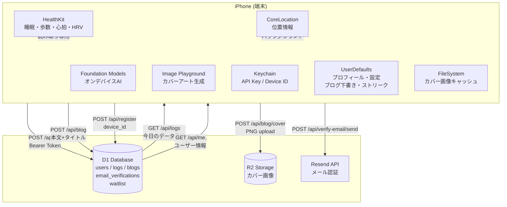
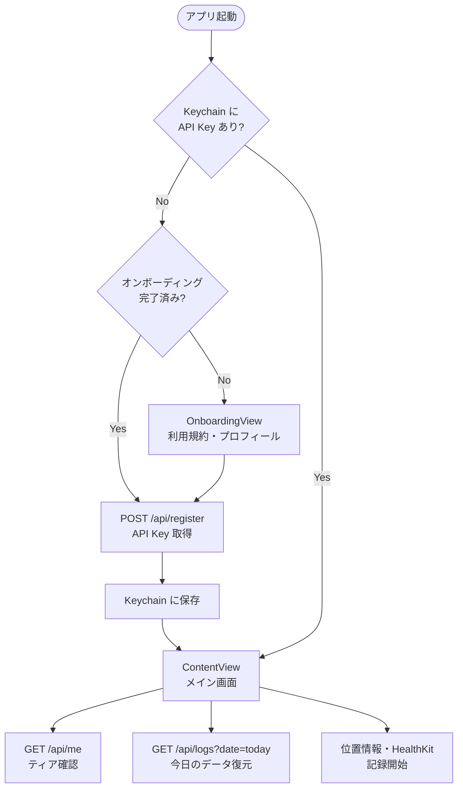
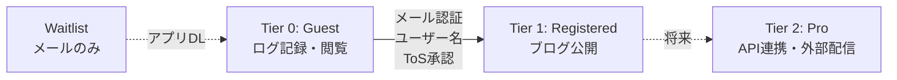

# nehan.ai

iPhoneのヘルスケアデータから日報を自動生成するライフログアプリ。

## データフロー — 端末 vs クラウド



## 認証・起動フロー



## ティアモデル



| Tier | 名称 | 条件 | できること |
|------|------|------|-----------|
| — | Waitlist | LP でメール登録 | リリース通知 |
| 0 | Guest | アプリ起動 + device 登録 | ログ記録・同期・閲覧・下書き |
| 1 | Registered | メール認証 + ユーザー名 + ToS | ブログ公開・カバーアート |
| 2 | Pro (将来) | サブスクリプション | API連携・外部配信 |

## データ所在一覧

| データ | 端末 | クラウド | 備考 |
|--------|------|---------|------|
| API Key | Keychain | users.api_key_hash (SHA-256) | 端末: 平文 / クラウド: ハッシュのみ |
| Device ID | Keychain | users.device_id | UUID, アプリ再インストールでも維持 |
| プロフィール (生年月日・性別・言語) | UserDefaults | users (demographics) | 双方に保存、端末が正 |
| HealthKit データ | HealthKit (OS管理) | logs テーブル (数値のみ) | 端末: 生データ / クラウド: 集計値 |
| 位置情報 | CoreLocation (OS管理) | logs テーブル (緯度経度) | シークレット場所は座標なし |
| ブログ本文 | UserDefaults (下書き) | blogs テーブル | 公開後は端末の下書きを削除 |
| カバー画像 | Documents/ (PNG) | R2 Storage | 端末: キャッシュ / クラウド: 正本 |
| AI生成テキスト | — (メモリのみ) | blogs.body に含まれる | Foundation Models でオンデバイス生成 |
| メール認証コード | — | email_verifications | 10分TTL、使い捨て |
| ブログストリーク | UserDefaults | — | 端末のみ (将来クラウド化検討) |
| 座標メモ (PlaceBookmark) | UserDefaults | — | 端末のみ、プライバシー保護 |

## セキュリティ方針

- HealthKit データは広告目的に使用禁止 (Apple ガイドライン)
- 全 API 通信は HTTPS + Bearer Token
- AI処理は Foundation Models (オンデバイス)、外部 AI サービス不使用
- パスワードなし認証 (Device ID + メール認証コード)
- カバー画像は R2 に保存、公開ブログからのみアクセス可能

## 開発

```bash
# Worker
cd worker && npm install && npx wrangler dev

# iOS
open NehanAI/NehanAI.xcodeproj
# Xcode: iOS 26+ / iPhone 実機 (HealthKit はシミュレータ非対応)
```

詳細は [CLAUDE.md](CLAUDE.md) / [AGENTS.md](AGENTS.md) を参照。
